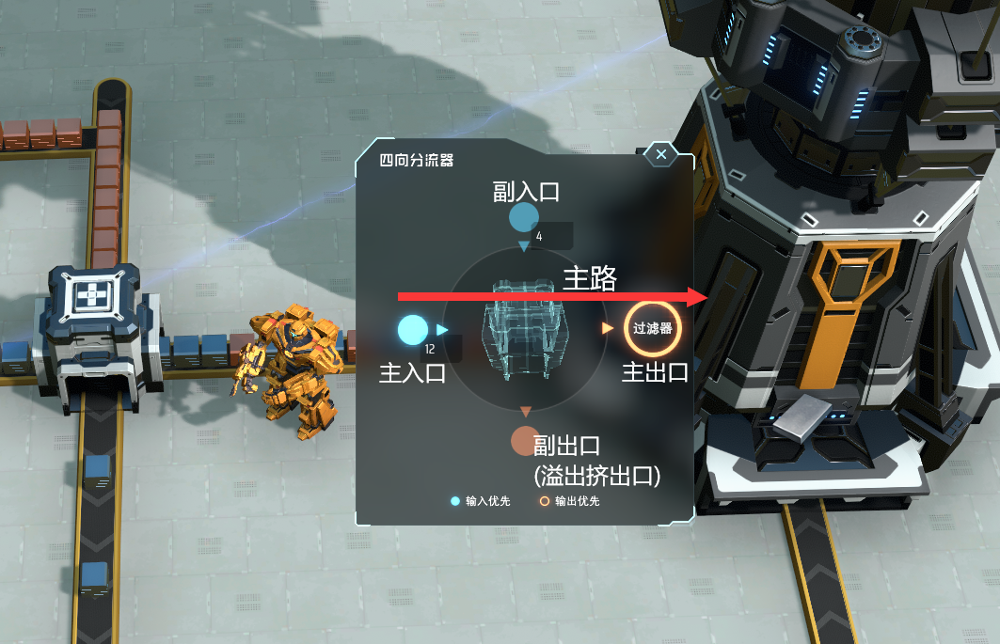

# SplitterController
此mod方案由rojindo提出，并专用于混带建设，目的是为了在尽可能确保环路不停顿的前提下，分析流过的物品的比例，决定是否插入新的物品，以控制环路的物品比例。

当且仅当原版四项分流器被设置为“2进口，2出口，且设置了一个优先入口、一个优先出口”时，四向分流器UI中会出现输入窗口，可以输入比例，从而按所写比例混入两个入口的材料，在确保主输入口流入不停顿的基础上，保证从主出口输出的“副入口物品”比“非副入口物品”的比例符合输入的比例。具体逻辑如下。

## 主要逻辑与使用
- 优先入口成为主入口，非优先入口成为副入口。出口同理。
- 用户需要对主入口和副入口分别输入比例（例如a:b）。
- 每当主入口通过a个“非副入口输入的物品”时，副入口会恰好将b个物品插入主入口输入流的空隙中。所有输出混在一起从主出口输出。
- 如果主入口物品持续满速，没有空隙可以插入，副入口仍会强行将b个物品插入并从主出口输出（以保证主出口输出的物品比例与设定值相同），此时主入口的物品仍然会被接收，只是会被挤出到副出口输出。由于是挤出物品而非让主输入口等待插入，因此主输入口不会停顿。
- 若副输入口缺货，主输入口的物品会直接输送到主输出口。

## 特殊情况与说明
- 只有副输出口堵满时，主输入口才有可能停顿或堵住。
- 以下情况时，四向分流器维持原版逻辑：
  - 四向分流器不满足“2进口，2出口，且设置了一个优先入口、一个优先出口”条件时；
  - a和b均被玩家设置成了0时；
  - 四向分流器被设置了输出物品过滤器时；
  - 四向分流器上方放置了箱子时。

## 其他说明
- 作者认为，“传送带物品记录功能，并依据该规则控制分拣器工作”是混带环路更好的解决方案，似乎已有人正在致力于相关的mod制作。
